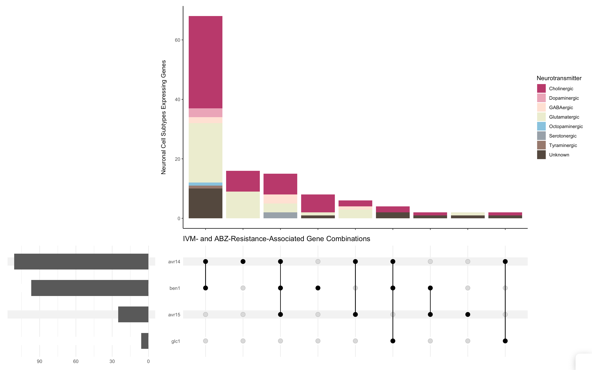

# UpSet ReadMe

Created: August 11, 2022
Created by: Anonymous
Tags: Andersen Lab, CeNGEN Project, R

## Overview

This code allows for the generation of UpSet plots to visualize data from the CeNGEN database. 

Required Packages:

- [R/ComplexUpset](https://github.com/krassowski/complex-upset)
- [R/Tidyverse](https://www.tidyverse.org)

## Data Acquisition

Expression data for various genes by neuronal cell subtype can be downloaded directly from [CeNGEN](https://cengen.shinyapps.io/CengenApp/). 

Neurotransmitter classification of each neuronal cell subtype was adapted from the [Neurotransmitters Table](https://www.wormatlas.org/neurotransmitterstable.htm) on [WormAtlas](https://www.wormatlas.org/index.html). 

- These data were adapted to be compatible with CeNGEN data. Edits were made to include the novel neuronal cell subtypes as described by [Taylor *et al.* 2021](https://doi.org/10.1016/j.cell.2021.06.023). The adapted data table is available within this repository in the “data” folder, titled “ModifiedforCeNGEN-Ce_NTtables_Loer&Rand2022.csv”

## Example Code

Example code is available comparing the expression of four genes: *avr-14*, *avr-15*, *glc-1*, and *ben-1.*

- The data downloaded from CeNGEN for this example are available within this repository in the “data” folder.
    
    